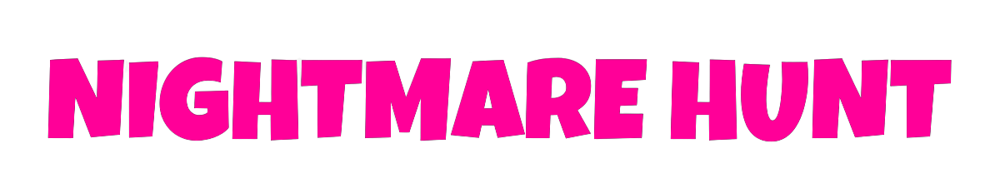

<h1 align="center">
  
</h1>

**- [Click here for English version.](README_EN.md)**
 
 

Survival Shooter desarrollado como práctica con el motor Unity y adaptado libremente a partir del tutorial de Survival Shooter disponible en Unity Learn.

## Compilación del proyecto

El proyecto se ha creado utilizando la versión 2021.3.5f1 de Unity.

Simplemente clona el repositorio o copia los archivos contenidos en él y abre el proyecto con Unity. Los recursos necesarios se instalarán automáticamente.

Una vez dentro del editor de Unity, se podrá modificar y compilar el proyecto.

## Instrucciones del juego

Para moverte a través de los menú, puedes utilizar el ratón.

Utiliza las teclas WASD para mover al personaje. Moviendo el ratón puedes apuntar en cualquier dirección, y con el botón derecho puedes disparar.

Elimina a tantos enemigos cuando puedas antes de que ellos te eliminen a ti.

## Descarga del juego

Actualmente, esta versión del juego puede descargarse de los siguientes sitios.

<a href="https://sergiomejias.itch.io/nightmare-hunt">
<a href="https://gamejolt.com/games/nightmare-hunt/739220">