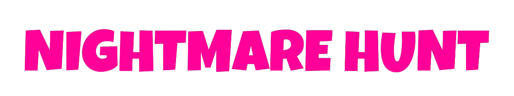
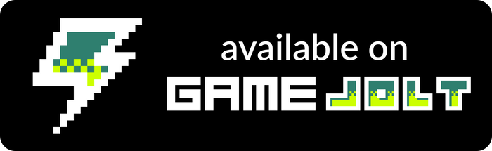

<h1 align="center">
  
</h1>

**- [Pulsa aquí para la versión en español.](README.md)**
 
 

Survival Shooter developed as a practice with the Unity engine and freely adapted from the Survival Shooter tutorial available in Unity Learn.

## Project build

The project is created using Unity 2021.3.5f1.

Just clone the repository or copy the files contained in it and open the project with Unity. The necessary resources will be installed automatically.

Once inside the Unity editor, the project can be modified and compiled.

## Game instructions

To move through the menus, you can use the mouse.

Use the WASD or the arrow keys to move the character. By moving the mouse you can aim in all directions and with the left button you can shoot.

Eliminate as many enemies as possible before they eliminate you.

## Game download

Currently, this version of the application can be downloaded from the following sites.

<a href="https://sergiomejias.itch.io/nightmare-hunt">
<a href="https://gamejolt.com/games/nightmare-hunt/739220">